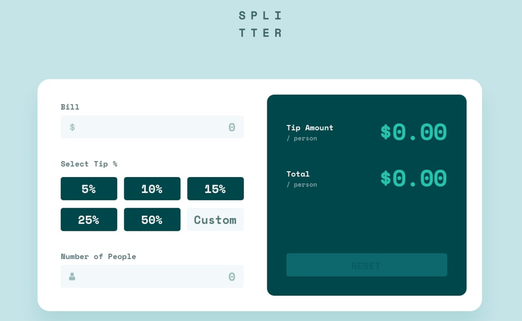

# Tip calculator app solution

Probably the most challenging project so far (in this beginning of road), because I had to deal with various exceptions (mainly because the app doesn't have a submit button, so the results have to update automatically every time a key pressed) and I use almost all of the knowledge I've been learning, which includes:

- Javascript: I used a lot of DOM manipulation, understanding his various methods; I broke apart the JS solution into some separate functions e called them in the right order; Deal with the function parameters; prevented negative inputs, zero inputs, NaN results...; etc.

- CSS: used a lot of flexbox, as always, which is becoming usual, but in this case I had to deal with grid too, and I think I did it well; I had to style inputs (text and radio - borders, pseudo elements, disabled states, etc), which was fun; Responsiveness was fun too.

- HTML: dealing with the propertys of HTML inputs was new for me, and I think it was very important to learn this. 

## Overview

### The challenge

Users should be able to:

- View the optimal layout for the app depending on their device's screen size
- See hover states for all interactive elements on the page
- Calculate the correct tip and total cost of the bill per person

### Screenshot

### Links

- The app can be viewed here: [Tip calculator app](https://r-mayer.github.io/tip-calculator-app/)